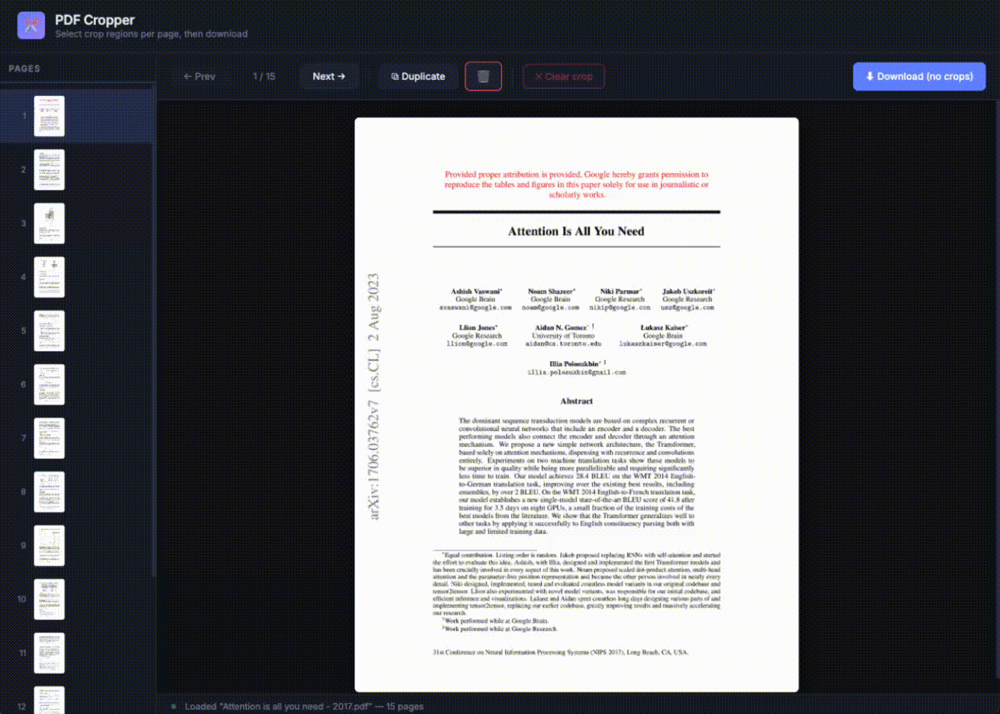

# pdf-cropper

A locally-hosted web app for cropping individual pages of a PDF — each page independently.



## Why

Tools like [Stirling PDF](https://github.com/Stirling-Tools/Stirling-PDF) and [BentoPDF](https://bentopdf.com) apply the same crop rectangle to every page. That's fine if you have a uniform document, but it's not ideal for scanned books or mixed-format PDFs where each page needs a different crop. I built this to handle exactly that case.

## Features

- Open any PDF and view pages one at a time
- Draw a crop rectangle on each page independently — or leave pages uncropped
- Pan and resize an existing crop by dragging it or its handles
- Duplicate a page (useful for splitting a single scanned spread into two differently-cropped slides)
- Sidebar thumbnail preview with per-page crop indicators
- Download the result as `<original_filename>_cropped.pdf`

## Requirements

- [uv](https://github.com/astral-sh/uv)

No other setup needed. Dependencies are installed automatically on first run.

## Usage

```bash
git clone https://github.com/yourname/pdf-cropper
cd pdf-cropper
uv run pdf-cropper
```

Then open **http://127.0.0.1:8000** in your browser.

## How it works

- **Backend**: FastAPI + [PyMuPDF](https://pymupdf.readthedocs.io/) (`fitz`). Pages are rendered server-side as PNGs; crops are applied by setting PDF crop boxes before generating the output.
- **Frontend**: Vanilla HTML/CSS/JS. Crop state lives entirely in the browser until you click Download, at which point the ordered list of slides and their crop coordinates is sent to the server in a single request.
- **No external services**: everything runs locally.
